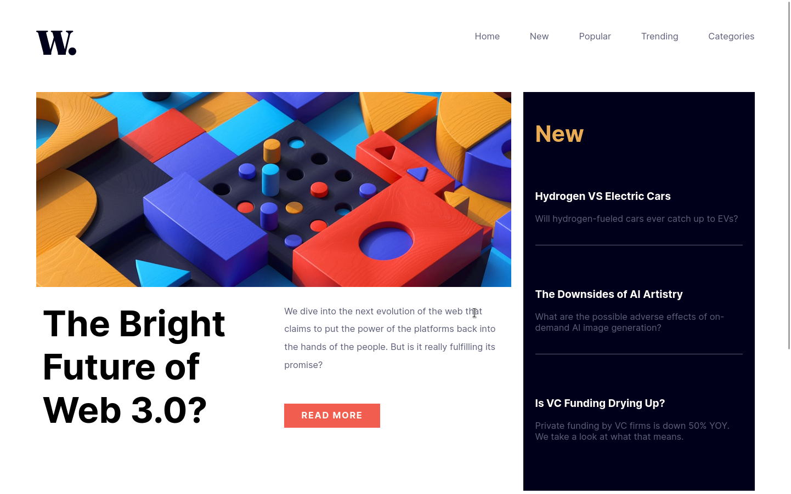
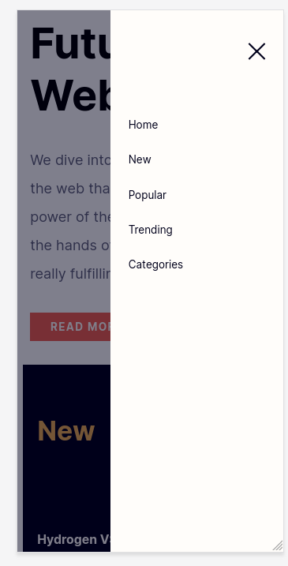

# Frontend Mentor - News homepage solution

This is a solution to the [News homepage challenge on Frontend Mentor](https://www.frontendmentor.io/challenges/news-homepage-H6SWTa1MFl). Frontend Mentor challenges help you improve your coding skills by building realistic projects. 

## Table of contents

- [Overview](#overview)
  - [The challenge](#the-challenge)
  - [Screenshot](#screenshot)
  - [Links](#links)
- [My process](#my-process)
  - [Built with](#built-with)
  - [What I learned](#what-i-learned)
  - [Continued development](#continued-development)
  - [Useful resources](#useful-resources)
- [Author](#author)
- [Acknowledgments](#acknowledgments)


## Overview

### The challenge

Users should be able to:

- View the optimal layout for the interface depending on their device's screen size
- See hover and focus states for all interactive elements on the page

### Screenshot






### Links

- Solution URL: [News Homepage](https://github.com/garyeung/Frontend-Mentor-Challenges/tree/master/news-homepage-main{:target="_blank"})
- Live Site URL: [News Homepage live site](https://garyeung.github.io/Frontend-Mentor-Challenges/news-homepage-main)

## My process

### Built with

- Semantic HTML5 markup
- CSS custom properties
- Flexbox
- CSS Grid
- less
- Typescript

### What I learned

I learned how to use CSS grild and found it to be  more flexible and customisable than CSS flex.  
P.S. CSS should be organised by modules and components.
```css
.container {
  display: grid;
  grid-template-columns: repeat(3, 1fr);
  grid-template-rows: 0.5fr 4fr 1.5fr;
  grid-template-areas: "header header header" "main   main  sidebar" "footer footer footer";
  max-width: 1200px;
  margin: 50px auto;
  gap: 20px;
}
```

### Continued development
I should use a frontend framework for the next challenge, because I think I should modularise the web page into units of components. This would be better for further developement.

### Useful resources

## Author


## Acknowledgments