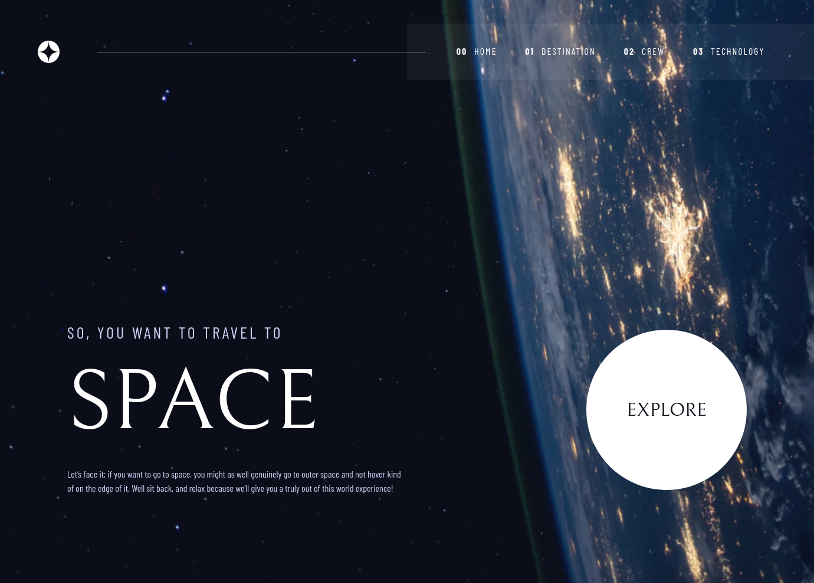

# Frontend Mentor - Space tourism website solution

This is a solution to the [Space tourism website challenge on Frontend Mentor](https://www.frontendmentor.io/challenges/space-tourism-multipage-website-gRWj1URZ3). Frontend Mentor challenges help you improve your coding skills by building realistic projects. 

## Table of contents

- [Overview](#overview)
  - [The challenge](#the-challenge)
  - [Screenshot](#screenshot)
  - [Links](#links)
- [My process](#my-process)
  - [Built with](#built-with)
  - [What I learned](#what-i-learned)
  - [Continued development](#continued-development)
  - [Useful resources](#useful-resources)
- [Author](#author)
- [Acknowledgments](#acknowledgments)

## Overview

### The challenge

Users should be able to:

- View the optimal layout for each of the website's pages depending on their device's screen size
- See hover states for all interactive elements on the page
- View each page and be able to toggle between the tabs to see new information

### Screenshot

### Links
- Solution URL: [Space Tourism Website Solution](https://github.com/garyeung/Frontend-Mentor-Challenges/tree/master/space-tourism-website-main)
- Live Site URL: [Space Tourism Website Live](https://space-tourism-webisite.vercel.app/)

## My process

### Built with

- [React](https://reactjs.org/) - JS library
- [Vite](https://vitejs.dev/)  - For development and building 
- [TailwindCSS](https://tailwindcss.com/) - CSS Framework
- [React Router](https://reactrouter.com/) - Routing

### What I learned
Learned how to styling the website acrroding to the design in figma
Learned how to routing different pages by react router

### Continued development
Using a full stack framwork to build a real webisite

### Useful resources

## Author

## Acknowledgments
